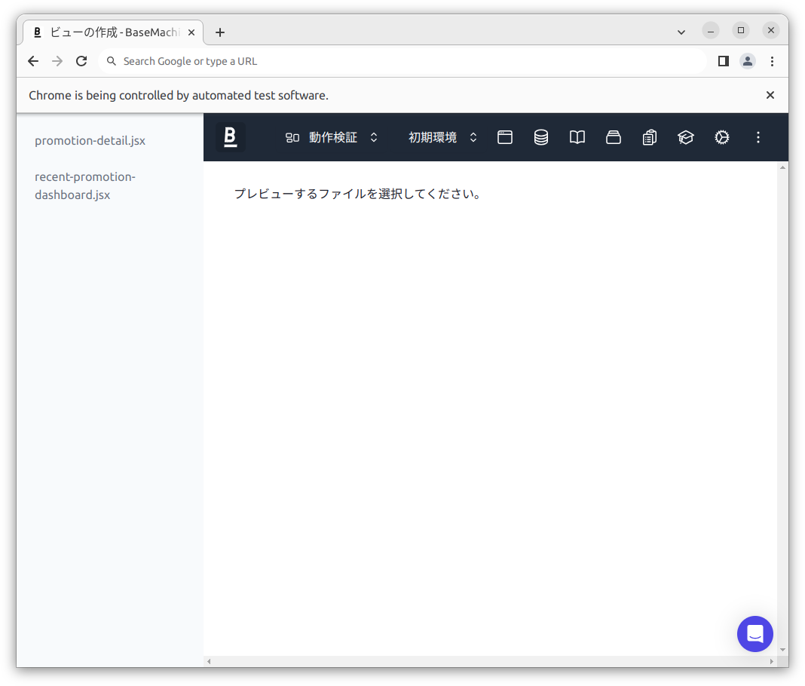

# bm-view-preview

ローカル環境のファイルの更新を検知して、ベースマキナのビュー機能のコードエディタに自動で反映するツールです。

## 使い方

### 動作確認環境

macOSおよびLinux (Ubuntu)のNode.js v20での動作を確認しています。

### インストール

1. ビューのファイルを管理するリポジトリを用意する
1. `package.json`を作成する
1. `npm install --save-dev @basemachina/bm-view-preview`を実行する
1. 設定ファイルを作成する

#### 設定ファイルの作り方

以下のように`bm-view-preview.config.json`を作成してください。

```
$ cat > bm-view-preview.config.json
{
  "baseUrl": "https://{your_tenant}.basemachina.com/projects/{your_project_id}/environments/{your_environment_id}",
  "sourceDir": "./dist",
  "allowedEnvironments": [
      '許可する環境ID',
      '許可する環境ID',
  ]
}
```

- `baseUrl`: ビュー機能のプレビューを実行する環境のURLを指定してください。
- `sourceDir`: プレビューするファイルのあるディレクトリのパスを指定してください。設定ファイルからの相対パスが使えます。
- `allowedEnvironments`: （Optional）ローカル環境で許可する環境IDリストを指定してください。 
  - 設定した場合、ここに記載した環境ID以外の環境IDを選択ときに `baseUrl` へリダイレクトします。 
  - ローカル環境から本番環境などにアクセスしないようにするための制御等で使用します。

### 起動方法

以下のコマンドを実行してください。

```
$ npx bm-view-preview
```

起動すると新しいプロファイルのChromeが開きます。（プロファイルは`~/.cache/bm-view-preview/chromium_profile`に保存されます。）

ページ内に`sourceDir`のファイルが一覧表示され、選択したファイルがプレビュー表示されます。ファイルを更新すると自動でプレビューに反映されます。



## 開発方法

- 依存パッケージのインストール: `pnpm install`
- 起動: `node bin/bm-view-preview`
